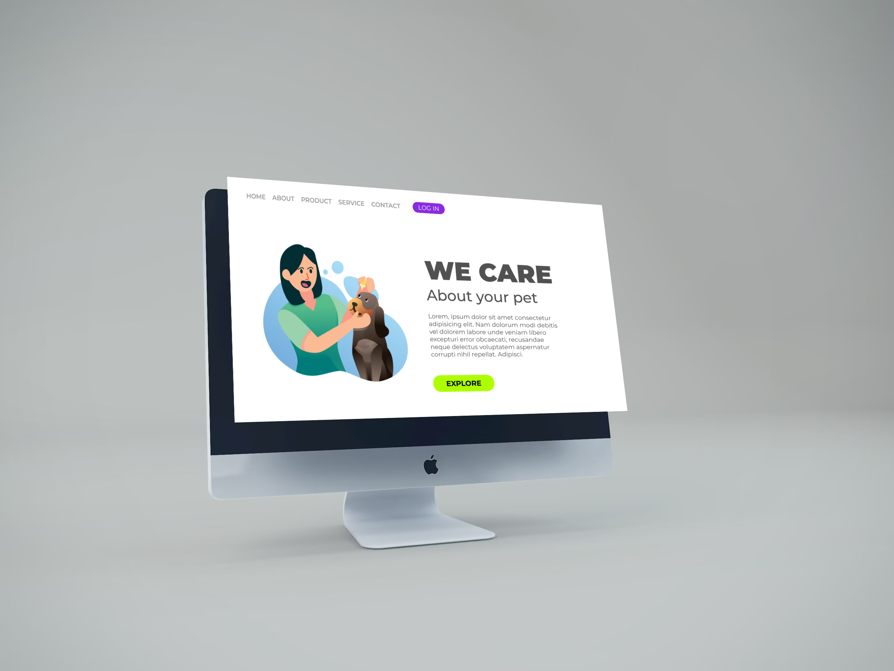
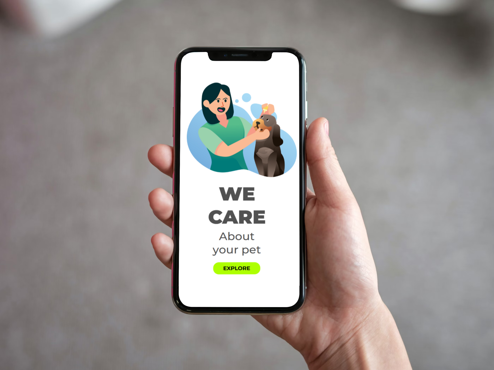

## WE ARE CARE
<h1>o 2.º projeto pelo <a href="https://rodolfomori.com.br/devclub/">DevClub</a></h1>
 
<h2>Sobre ele </h2>

Esse projeto foi desenvolvido a partir do módulo de HTML E CSS para a prática de todo aprendizado que eu tive durante as aulas.

## Funcionalidades
<h2>O site oferece algumas funcionalidades pelo NAVBAR</h2>
<ol>
  <li>O link para conhecer a história da loja de petshop</li>
  <li>Os produtos que o petshop oferece para seus clientes</li>
  <li>Os serviços prestados pela a loja</li>
  <li>O fale conosco através do contact</li>
  <li>O portal do cliente para quem deseja entrar ou se cadastrar para garantir descontos exclusivos pela a loja</li>
</ol>
<h2>Seção principal</h2>

Onde tem a imagem da logo do petshop e algumas descrições sobre ele.

<h1>Let's plan on your smartphone and notebook</h1>
<h2>DESKTOP</h2>

<h2>MOBILE</h2>

